# ハンズオンの目的

Custom Instructions や Agent Skills の作成方法や利用の効果を学ぶための短時間のハンズオンとなります。
（およそ1時間で終了する想定です）

Claude Sonnet 4.6 でドライランしています。

## 0. 前提とシナリオ

- ユーザー管理をするアプリケーションが既に存在します
- アプリケーションでは会社で作成されている想定の独自ライブラリが利用されています
  - ライブラリ内のすべてのコントロールがアプリ内で利用されているわけではありません
- このアプリケーションに対して項目を追加する開発を実施するというシナリオです

### 0.1 事前準備

今回のシナリオでは Agentic Browser を使用します。
VS Code の設定で「workbench.browser.enableChatTools」を確認しチェックボックスを入れてください
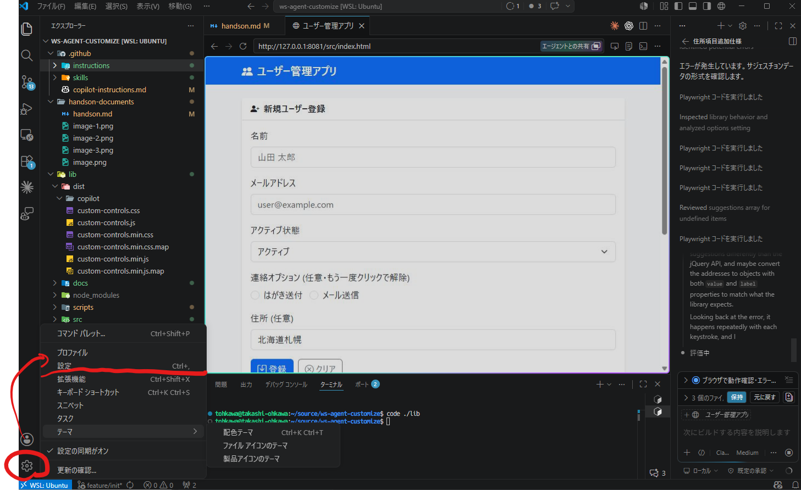

設定の検索画面で「workbench.browser.enableChatTools」で検索すれば出てきます。

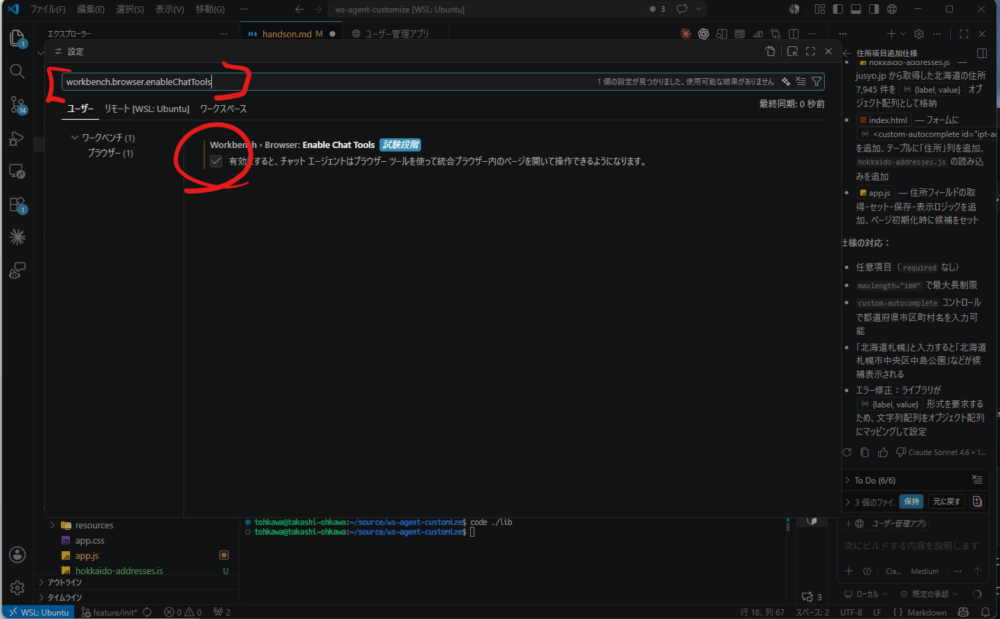

## 1. アプリケーションが動作するか確かめる

アプリケーションが動作するか確かめます。今回は立ち上げるだけではなくログインや簡単な操作ができるか Agent に確認してもらいます。

``` markdown
アプリケーションを動作させてください。
動作後 #browser でアクセスしてログイン以降の各機能が動作するかも確認してください。
```

### 実行結果から確認すべきポイント

- `lib` の依存が未インストールだとビルドが失敗するため、Agent が自律的に `npm install --prefix lib` を実行してリカバリできているか確認する。
- `custom-autocomplete` コントロールがライブラリに存在するが現アプリでは未使用であり、`/lib` を参照できない Agent はその存在を認識できないことを把握しておく。
- 新規登録・編集・バリデーション・削除の CRUD 各機能と Toast 通知・確認モーダルが正しく動作しているか確認する。

## 2. 項目を追加してみる

下記のプロンプトを実行し項目を追加してみましょう

``` markdown
アプリケーションで管理されている項目に住所の項目を追加します
コントロールは下記の仕様で動作します

- 任意の項目です
- 最大長の制限があります
- 都道府県市区町村の名前で管理されます
- 入力の簡素化のためオートコンプリートで入力が可能です
  - 例えば「北海道札幌」まで入力すると「北海道札幌市中央区旭ヶ丘」や「北海道札幌市中央区内橋」が候補として表示されます
- オートコンプリートで表示される住所は jusyo.jp で管理されている 全国の住所情報のCSVから配列を作成し使用されます
- 北海道で使用される想定の為北海道の住所情報だけで結構です

作業後 #browser で改修部分の動作を確認しエラーが発生するようであれば修正してください。
```

おそらく問題なくアプリケーションは編集されるはずですが、フレームワークの利用方法としては誤っています。
フレームワークにはすでにオートコンプリートを持つコントロールが存在する為そのコントロールを使用するほうが正しいです。
このようにライブラリなど参照できない箇所にある情報は使用されないので個別でカスタマイズが必要になります。
関わるドキュメントも少ないです。

これは正しい実装ではないので「元に戻す」で戻しておきます。
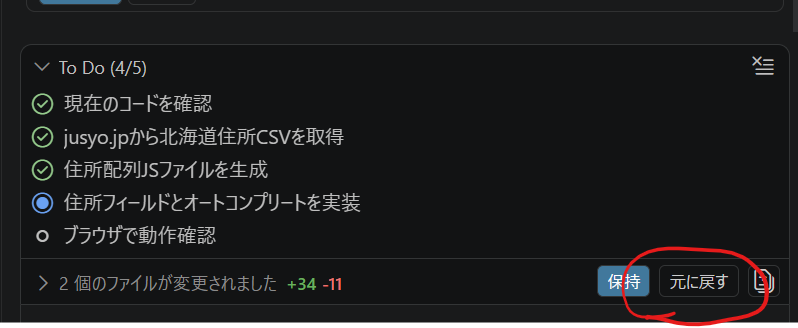
※新規作成のファイルは削除してしまいます

### Tips: エージェントデバッグログ画面

エージェントがどのように動いたのかやトークンの利用状況をデバッグ画面から確認できます。
今回はそもそもコード量自体が少ないためそこまで大きな効果は得られないかもしれませんが、customize の効果を確かめるために有効です。

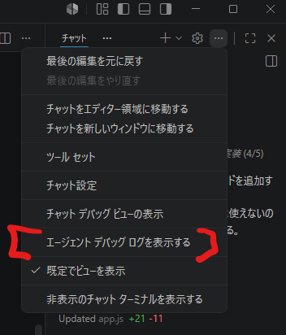

`Enable in Settings` を選択
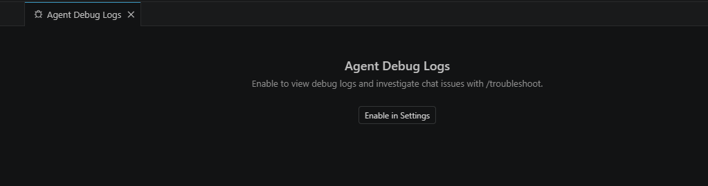

出てきた画面で設定を有効にする。
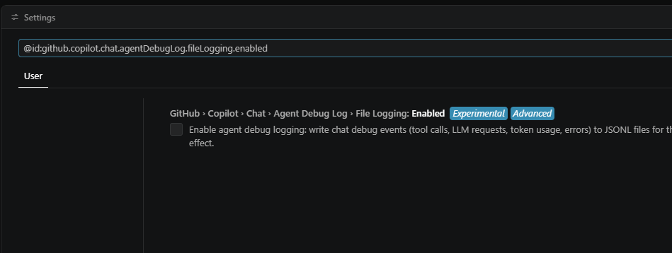

右上…で  Agentはなくて、 Show Chat Debug View する事で左メニューバーに表示される
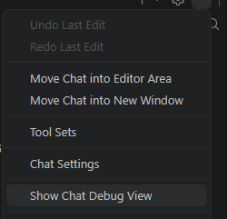

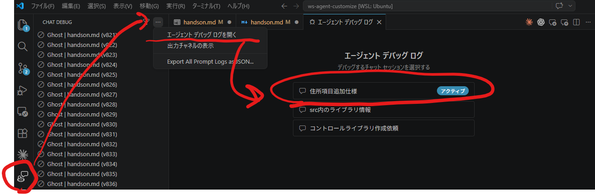

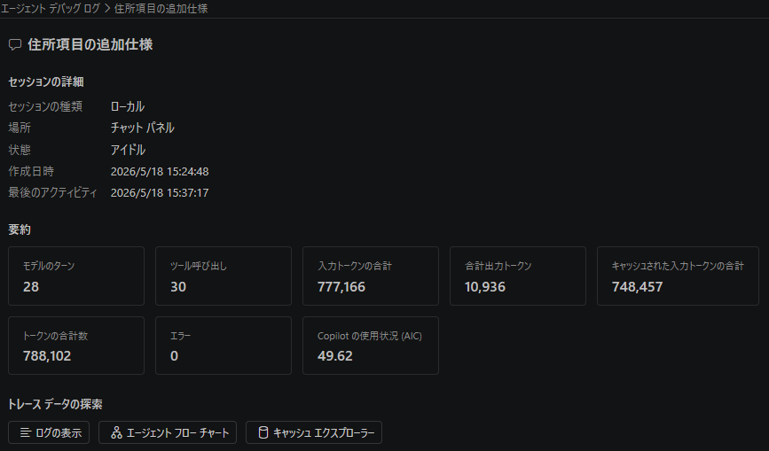

## 2. Skill を作成してみる

ライブラリディレクトリ内の情報は参照されない状態になっていますので
`/lib` でVS Codeを開きライブラリ専用の Skill を作成してから本体で利用する様にします。

## 2.1 lib ディレクトリを VS Code で開き状態を確認する

ターミナルで `code ./lib` で VS Code を開きます。

## 2.2 ライブラリの使用方法についてのドキュメント（マニュアル）を作成する

今回の問題はライブラリの仕様の仕方がわからないということが原因のひとつでした。
ライブラリの仕様書ではなく特定の役割に特化したマニュアルをソースコードから作ってみます。

``` markdown
このワークスペースではユーザーにUIコントロールを提供するライブラリが開発されています。
このワークスペースで作成されている機能の使い方について記述したマニュアルを作成し
`/docs` に格納してください。
```

## 2.2 ライブラリ用のカスタマイズファイルの作成

開いた VS Code 上で Copilot を利用してライブラリを使用するためのカスタマイズファイルを構築します。
ただし、Instruction/Skill/Custom Agent のどれが適切かどうかまだわからないのでその精査から行います。

まずは、Skill を作成するのに役立つビルドインスキルなどが存在するか確認します。

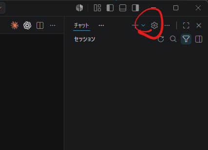

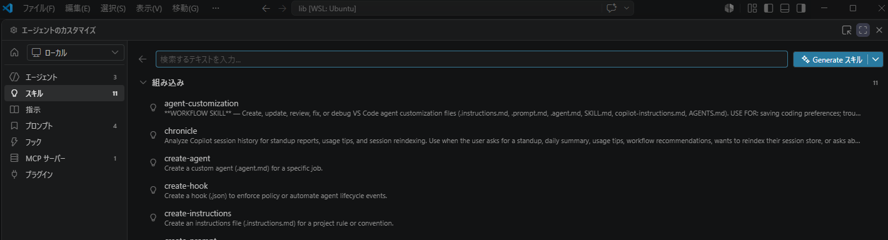

`agent-customization` や `create-skill` などの Skill があることが確認できれば OK です。
確認ができたら下記のプロンプトを実行します。

``` markdown
このワークスペースで開発されているライブラリをAIが適切に利用するためのカスタマイズファイルを作成します。
Agent Skills、Instructions、Custom Agentの内、どれを作成するが適切でしょうか。複数となっても大丈夫です。
```

おそらく、調査が行われたと思うので推奨となっているものを作成してもらいます。

``` markdown
最優先とオプションのファイルを作成してください。
ライブラリを利用する側で使用する想定なので、Publishする `dist` に含めて作成してください。
```

## 3 カスタマイズのワークスペースへの摘要

## 3.1 作成されたカスタマイズファイルの移動とレビュー

元の VS Code に戻り、dist 内に作成された `.github` ディレクトリをワークスペースルートに移動させます。
現時点のディレクトリ構造やファイル構造にマッチしていない可能性があるので、`agent-customization` を使ってレビューし必要があれば修正してもらいます。

``` markdown
このワークスペースで管理されている `instructions` と `skills` をレビューし
現在のデイレクトリ構造や言語の利用状況にマッチしていないか確認を行い必要があれば修正してください。
```

## 3.2 このワークスペースの Instruction ファイルの作成

このワークスペースに最適化されたインストラクションファイルを作成します。

``` markdown
/init ワークスペースのインストラクションファイルを作成してください。必要があれば要素ごとに分割を行ってください。
```

# 4. 項目を追加してみる

下記のプロンプトを実行し項目を追加してみましょう

``` markdown
アプリケーションで管理されている項目に住所の項目を追加します
コントロールは下記の仕様で動作します

- 任意の項目です
- 最大長の制限があります
- 都道府県市区町村の名前で管理されます
- 入力の簡素化のためオートコンプリートで入力が可能です
  - 例えば「北海道札幌」まで入力すると「北海道札幌市中央区旭ヶ丘」や「北海道札幌市中央区内橋」が候補として表示されます
- オートコンプリートで表示される住所は jusyo.jp で管理されている 全国の住所情報のCSVから配列を作成し使用されます
- 北海道で使用される想定の為北海道の住所情報だけで結構です

作業後 #browser で改修部分の動作を確認しエラーが発生するようであれば修正してください。
```

# 5. Skill や Instructions をブラッシュアップする

ライブラリの構造が変更されたときなど定期的にブラッシュアップしたほうが良いですが、既存の Skill や Instructions のナレッジに沿って改善を行うことも可能です。

`awesome-copilot` の [agent.skills.md](https://github.com/github/awesome-copilot/blob/main/instructions/agent-skills.instructions.md)や[agents.instructions.md](https://github.com/github/awesome-copilot/blob/main/instructions/agents.instructions.md)、他関連のある言語などのファイルを使ってブラッシュアップを行います。

``` markdown
構築されたAgentSkillsとInstructionsの改善を実施します。
現在のアプリケーションの状態を、下記のリソースを使用し改善を実施してください。
社内のみで使用する想定の為ライセンス関係の改善は不要です。
- [agent.skills.md](https://github.com/github/awesome-copilot/blob/main/instructions/agent-skills.instructions.md)
- [agents.instructions.md](https://github.com/github/awesome-copilot/blob/main/instructions/agents.instructions.md)
```